# 🎨 UML DIAGRAMS - MERMAID FORMAT

# Buka di: https://mermaid.live atau langsung di GitHub

## 1️⃣ CLASS DIAGRAM - MERMAID


---

## 2️⃣ SEQUENCE DIAGRAM - addToCart() FLOW


---

## 3️⃣ SEQUENCE DIAGRAM - checkout() FLOW

```mermaid
sequenceDiagram
    actor Cashier
    participant Browser
    participant Controller as CashierController
    participant Menu as Menu Model
    participant Order as Order Model
    participant OrderItem as OrderItem Model
    participant Session
    participant Database as MySQL DB

    Cashier->>Browser: Click Checkout
    Browser->>Controller: POST /cashier/checkout

    Note over Controller: Validate payment_method & discount

    Controller->>Session: Get cart items
    Session-->>Controller: Cart data

    alt Cart is Empty
        Controller-->>Browser: Error 400 JSON
    else Cart has Items
        loop For Each Item in Cart
            Controller->>Menu: Check hasEnoughStock()

            alt Stock Insufficient
                Controller-->>Browser: Error 422 JSON
                Note over Browser: Show error & stop
                break
            end
        end

        Note over Controller: All items OK - Calculate totals
        Controller->>Controller: Calculate subtotal, discount, final amount

        rect rgb(200, 220, 255)
            Note over Controller,OrderItem: Transaction Start

            Controller->>Order: Create Order Record
            Database->>Order: INSERT Order
            Order-->>Controller: Order ID returned

            loop For Each Cart Item
                Controller->>OrderItem: Create OrderItem
                Database->>OrderItem: INSERT OrderItem

                Controller->>Menu: Increment sold_quantity
                Database->>Menu: UPDATE sold_quantity++

                Controller->>Menu: Decrease stock
                Database->>Menu: UPDATE stock--
            end

            rect rgb(200, 255, 200)
                Note over Controller,Session: Clear Session
                Controller->>Session: forget('cashier_cart')
            end
        end

        Controller-->>Browser: Success JSON + Order Data
        Browser-->>Cashier: Show Receipt
    end
```

---

## 4️⃣ STATE DIAGRAM - CART & ORDER STATES

```mermaid
stateDiagram-v2
    [*] --> EmptyCart

    EmptyCart --> CartWithItems: addToCart(menu_id, qty)

    CartWithItems --> CartWithItems: addToCart()\n(same item)\nOR\nupdateCart()

    CartWithItems --> CartWithItems: removeFromCart()\n(if >1 item)

    CartWithItems --> EmptyCart: removeFromCart()\n(last item)\nOR\nclearCart()

    CartWithItems --> OrderCreated: checkout()\n✓ Stock OK

    CartWithItems --> CartWithItems: Stock validation failed\n❌ Error 422

    OrderCreated --> [*]

    EmptyCart --> [*]
```



---

## 5️⃣ ACTIVITY DIAGRAM - COMPLETE CHECKOUT


---

## 6️⃣ COMPONENT DIAGRAM - LAYERED ARCHITECTURE

```mermaid
graph TB
    subgraph UI["🎨 PRESENTATION LAYER"]
        CashierView["Cashier Interface View"]
        CartDisplay["Cart Display Component"]
        ReceiptTemplate["Receipt Template"]
    end

    subgraph Logic["⚙️ APPLICATION LOGIC LAYER"]
        CashierCtrl["CashierController"]
    end

    subgraph Business["💼 BUSINESS LOGIC LAYER"]
        MenuModel["Menu Model<br/>+ hasEnoughStock()<br/>+ decreaseStock()"]
        OrderModel["Order Model"]
        OrderItemModel["OrderItem Model"]
    end

    subgraph Data["🗄️ DATA ACCESS LAYER"]
        EloquentORM["Eloquent ORM<br/>Query Builder<br/>Model Relations"]
    end

    subgraph DB["💾 DATABASE LAYER"]
        MySQL["MySQL Database<br/>Tables: menus, orders,<br/>order_items, categories"]
    end

    CashierView -->|HTTP Request| CashierCtrl
    CashierCtrl -->|JSON Response| CashierView
    CartDisplay -->|Display| CashierView
    ReceiptTemplate -->|Display| CashierView

    CashierCtrl -->|Business Logic| MenuModel
    CashierCtrl -->|Create| OrderModel
    CashierCtrl -->|Create| OrderItemModel

    MenuModel -->|ORM| EloquentORM
    OrderModel -->|ORM| EloquentORM
    OrderItemModel -->|ORM| EloquentORM

    EloquentORM -->|SQL Queries| MySQL

    style UI fill:#e1f5ff
    style Logic fill:#fff3e0
    style Business fill:#f3e5f5
    style Data fill:#e8f5e9
    style DB fill:#fce4ec
```



---

## 7️⃣ USE CASE DIAGRAM

```mermaid
graph LR
    Cashier["👤 Cashier"]

    subgraph ViewPhase["1️⃣ View Phase"]
        ViewMenu["View Available<br/>Menus"]
        FilterCat["Filter by<br/>Category"]
        ViewDetails["View Menu<br/>Details"]
    end

    subgraph CartPhase["2️⃣ Cart Management"]
        AddCart["Add to Cart"]
        UpdateQty["Update<br/>Quantity"]
        RemoveCart["Remove from<br/>Cart"]
        ViewCart["View Cart<br/>Total"]
    end

    subgraph CheckoutPhase["3️⃣ Checkout"]
        SelectPayment["Select Payment<br/>Method"]
        EnterDiscount["Enter Discount<br/>Percentage"]
        FinalValidate["Final Stock<br/>Validation"]
    end

    subgraph ProcessPhase["4️⃣ Process & Complete"]
        CreateOrder["Create Order<br/>in Database"]
        DecreaseStock["Decrease Menu<br/>Stock"]
        PrintReceipt["Print Receipt"]
        ClearCart["Clear Cart"]
    end

    Cashier --> ViewMenu
    ViewMenu --> FilterCat
    FilterCat --> ViewDetails
    ViewDetails --> AddCart

    AddCart --> UpdateQty
    UpdateQty --> RemoveCart
    RemoveCart --> ViewCart
    ViewCart --> SelectPayment

    SelectPayment --> EnterDiscount
    EnterDiscount --> FinalValidate

    FinalValidate -->|✓ All OK| CreateOrder
    FinalValidate -->|❌ Stock Failed| AddCart

    CreateOrder --> DecreaseStock
    DecreaseStock --> ClearCart
    ClearCart --> PrintReceipt
    PrintReceipt --> Cashier

    style ViewPhase fill:#e3f2fd
    style CartPhase fill:#f3e5f5
    style CheckoutPhase fill:#fce4ec
    style ProcessPhase fill:#e8f5e9
```



---

## 8️⃣ DATA FLOW - SIMPLIFIED


---

## 9️⃣ CONTROL FLOW - addToCart()


---

## 🔟 CONTROL FLOW - checkout()


---

Generated: 2 Desember 2025
Format: Mermaid Diagram
Open at: https://mermaid.live
