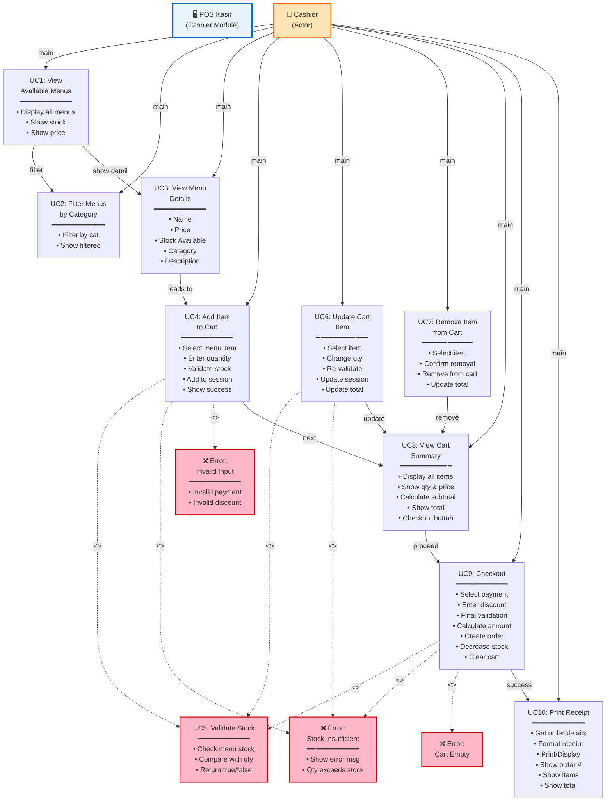
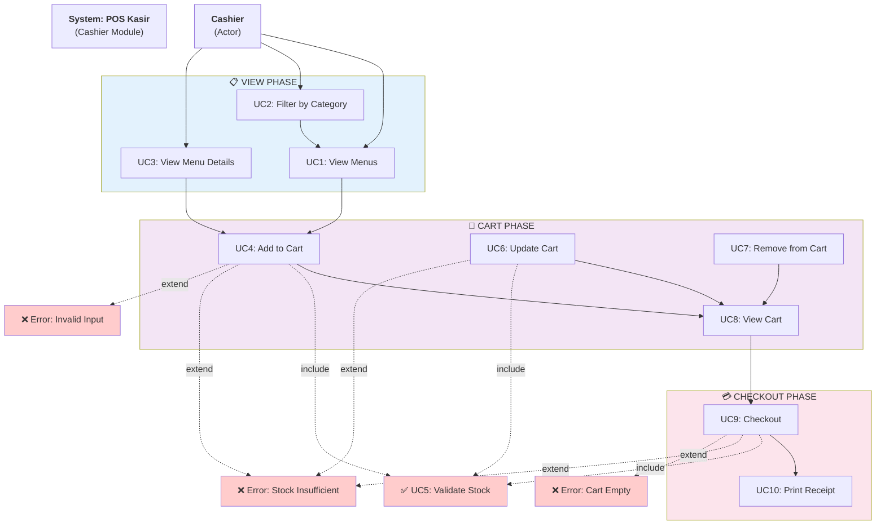

# 📋 USE CASE DIAGRAM - POS KASIR (Mermaid Code)

Buka di: https://mermaid.live dan paste code dibawah ini 👇

---

## 🎯 CODE MERMAID - USE CASE DIAGRAM



---

## 🚀 CARA PAKAI:

### **Step 1: Copy seluruh code diatas (mulai dari ` ```mermaid ` sampai ` ``` `)**

### **Step 2: Buka https://mermaid.live**

### **Step 3: Paste di area kode sebelah kiri**

### **Step 4: Diagram otomatis muncul di sebelah kanan!**

### **Step 5: Download PNG (klik tombol Export → PNG)**

---

## 📊 ALTERNATIF - Format Diagram Klasik (Lebih Mirip Original)



---

## 📋 DAFTAR USE CASE

| No  | Use Case                    | Deskripsi                                    |
| --- | --------------------------- | -------------------------------------------- |
| 1   | **UC1: View Menus**         | Cashier melihat semua menu tersedia          |
| 2   | **UC2: Filter by Category** | Cashier filter menu berdasarkan kategori     |
| 3   | **UC3: View Menu Details**  | Cashier lihat detail menu (harga, stok, dll) |
| 4   | **UC4: Add to Cart**        | Cashier tambah item ke keranjang             |
| 5   | **UC5: Validate Stock**     | System validasi ketersediaan stok ⭐         |
| 6   | **UC6: Update Cart**        | Cashier ubah quantity item di cart           |
| 7   | **UC7: Remove from Cart**   | Cashier hapus item dari cart                 |
| 8   | **UC8: View Cart**          | Cashier lihat ringkasan keranjang            |
| 9   | **UC9: Checkout**           | Cashier lakukan pembayaran & buat order      |
| 10  | **UC10: Print Receipt**     | Cashier cetak bukti transaksi                |

---

## 🔄 ALUR TRANSAKSI LENGKAP

```
👤 Cashier
    ↓
📋 UC1: View Menus (semua produk ditampilkan)
    ↓
🏷️ UC2: Filter by Category (opsional - filter kategori)
    ↓
📝 UC3: View Menu Details (lihat detail produk)
    ↓
🛒 UC4: Add to Cart + ✅ UC5: Validate Stock
    ├─ Jika stok tidak cukup → ❌ ERROR: Stock Insufficient
    └─ Jika OK → item masuk keranjang
    ↓
[Repeat: UC4 (add), UC6 (update qty), UC7 (remove)]
    ↓
👁️ UC8: View Cart (lihat total belanja)
    ↓
💳 UC9: Checkout
    ├─ Pilih payment method
    ├─ Enter discount
    ├─ Final validation: ✅ UC5: Validate Stock untuk SEMUA item
    ├─ Jika ada error → ❌ Error: Stock/Payment/Discount Invalid
    └─ Jika OK → Create Order + Decrease Stock
    ↓
📄 UC10: Print Receipt
    ↓
✅ END OF TRANSACTION
```

---

## 💡 TIPS

**Untuk hasil terbaik di mermaid.live:**

1. **Copy seluruh code** (jangan ada yang ketinggalan)
2. **Paste di sisi kiri** mermaid.live
3. **Tunggu 2 detik** untuk render
4. **Klik Export** → pilih PNG/SVG
5. **Download** gambar

---

**Generated:** 2 Desember 2025
**Format:** Mermaid Diagram (Universal)
**Kompatibel:** GitHub, GitLab, Notion, Confluence, docs semua
**Status:** ✅ Ready to use
